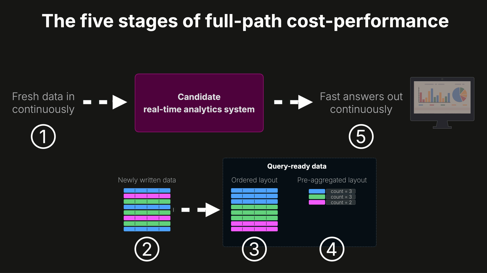

# CostBench

**An open benchmark for real-time analytics system cost-performance across the complete analytics path.**

CostBench measures how much performance each dollar actually buys you — not only when a query runs, but across the full system path that makes real-time analytics possible: fresh data in, query-ready data maintained, fast answers out, and the cost of keeping that path running.

> [!NOTE]
> **Why static query benchmarks are incomplete**
>
> Most database benchmarks load a static dataset once, let the system fully prepare it, then run each query multiple times and report the fastest hot-cache result. That measures repeated reads over stable, already-prepared data. It does not show the time and cost of making fresh data query-ready, or how queries behave when they run continuously over data that keeps changing, while ingest, maintenance, and refresh work keep running in parallel.

That is why CostBench focuses on **full-path cost-performance** to answer the question that matters:

> **Where do you get the most real-time analytics performance per dollar across the full path?**

## What CostBench measures

A real-time analytics benchmark needs to measure the system end to end:

1. Fresh data arrives continuously.
2. The system writes that data and makes it query-ready.
3. Raw data is kept in a layout that supports fast drill-down queries.
4. Pre-aggregated data is maintained for low-latency dashboard queries.
5. Queries are served continuously while ingest, maintenance, and refresh work keep running.

CostBench captures the cost and latency of those stages together, because different systems spend work in different places. One system may spend more on ingest. Another may spend more on background clustering, refresh compute, or query execution. A read-only query benchmark cannot show that full tradeoff.

CostBench is therefore **not a bulk-load or backfill benchmark**. It simulates a real-time analytics system where fresh data is continuously generated at the source and must become query-ready as it arrives.

## Methodology: full-path real-time cost-performance

The CostBench methodology measures the full real-time analytics path:

- continuous ingest at a fixed rate,
- raw-data organization for efficient drill-down queries,
- continuously maintained pre-aggregations,
- freshness of derived data,
- continuous query serving while data keeps arriving,
- and the cost of keeping all of that running.

This is the methodology described in the first end-to-end real-time analytics blog: [The end-to-end cost-performance of real-time analytics: Snowflake vs. ClickHouse Cloud](https://clickhouse.com/blog/real-time-analytics-cost-performance-snowflake-vs-clickhouse)

## Legacy methodology: read-side and write-side components

Earlier CostBench work measured important parts of the analytics path separately. Those results are still useful, but they are no longer the main methodology.

### Read-side cost-performance

The original read-side benchmark measured query cost-performance over already-loaded, already-prepared datasets. It compared how much query performance each dollar bought across major cloud data warehouses.

That methodology is useful for understanding query-engine efficiency, but it does not measure the cost of making fresh data query-ready, maintaining derived data, or serving queries while ingest and maintenance continue in parallel.

Related blog:

- **[How the 5 major cloud data warehouses compare on cost-performance](https://clickhouse.com/blog/cloud-data-warehouses-cost-performance-comparison)** — full read-side results at 1B / 10B / 100B rows, including the interactive explorer.

Repository path:

- **[Legacy read-side benchmark →](query-side-only/)**

### Query-ready raw data

The next step measured one write-side component of the real-time path: what it costs to keep continuously ingested raw data query-ready.

That benchmark focused on newly written raw data and physical organization. It did not include continuously maintained pre-aggregations or continuous query serving while ingest and maintenance continued. The full-path methodology expands on that by measuring ingest, raw-data organization, pre-aggregation freshness, refresh cost, and query execution together.

Related blog:

- **[Agentic analytics starts with query-ready data: the write-side cost of Snowflake vs. ClickHouse](https://clickhouse.com/blog/write-side-cost-performance-snowflake-clickhouse)** — measuring what it costs to keep continuously ingested data query-ready.

## Systems covered

CostBench has benchmark coverage across major cloud data warehouses, depending on the methodology and workload:

- ClickHouse Cloud
- Snowflake
- Databricks SQL Serverless
- Google BigQuery
- Amazon Redshift Serverless

The full-path real-time methodology is being expanded over time across more systems, ingest paths, datasets, and concurrency levels.

## How CostBench compares cost-performance

Cloud data warehouses expose cost through different units: credits, DBUs, slot-seconds, compute units, RPUs, serverless service credits, warehouse runtime, and storage. CostBench normalizes those vendor-specific billing models into a common question:

> How much work did the system need to complete the workload, and what did that work cost?

For full-path benchmarks, CostBench combines:

- fresh-data path cost,
- query cost,
- query runtime,
- freshness behavior,
- and the system configuration required to keep the workload running.

This makes it possible to compare systems even when they move work to different parts of the architecture, such as ingest compute, background clustering, materialized-view refresh, scheduled refresh warehouses, or query-serving compute.

## Open and reproducible

CostBench is open so benchmark claims can be inspected, reproduced, and improved.

The repository publishes:

- workload definitions,
- schema and table definitions,
- ingest scripts,
- query workloads,
- system configurations,
- pricing assumptions,
- raw result files,
- cost calculations,
- and methodology notes for each benchmark.

If a result looks surprising, you can inspect the setup that produced it. If a configuration can be improved, it can be reviewed and corrected in the open.

Issues and pull requests are welcome.

## Read more

### Current full-path methodology

- **[Introducing CostBench: an open benchmark for data warehouse cost-performance](https://clickhouse.com/blog/costbench-data-warehouse-cost-performance)** — what CostBench is and why cost-performance matters in the agentic era.
- **[The end-to-end cost-performance of real-time analytics: Snowflake vs. ClickHouse Cloud](https://clickhouse.com/blog/real-time-analytics-cost-performance-snowflake-vs-clickhouse)** — full-path real-time analytics cost-performance: continuous ingest, query-ready data, pre-aggregation freshness, and continuous query serving.

### Legacy component benchmarks

- **[How the 5 major cloud data warehouses compare on cost-performance](https://clickhouse.com/blog/cloud-data-warehouses-cost-performance-comparison)** — read-side cost-performance at 1B / 10B / 100B rows, including the interactive explorer.
- **[Agentic analytics starts with query-ready data: the write-side cost of Snowflake vs. ClickHouse](https://clickhouse.com/blog/write-side-cost-performance-snowflake-clickhouse)** — the cost of keeping continuously ingested raw data query-ready.

### Billing model background

- **[How the 5 major cloud data warehouses really bill you: a unified, engineer-friendly guide](https://clickhouse.com/blog/how-cloud-data-warehouses-bill-you)** — credits, DBUs, compute units, slot-seconds, and RPUs explained on equal footing.

## Contributing

CostBench is open because cost-performance claims should be reviewable. If you spot a setup that can be improved, a pricing detail that should be updated, or a vendor configuration worth adding, please contact us.

## License

See [LICENSE](LICENSE) in this repository.