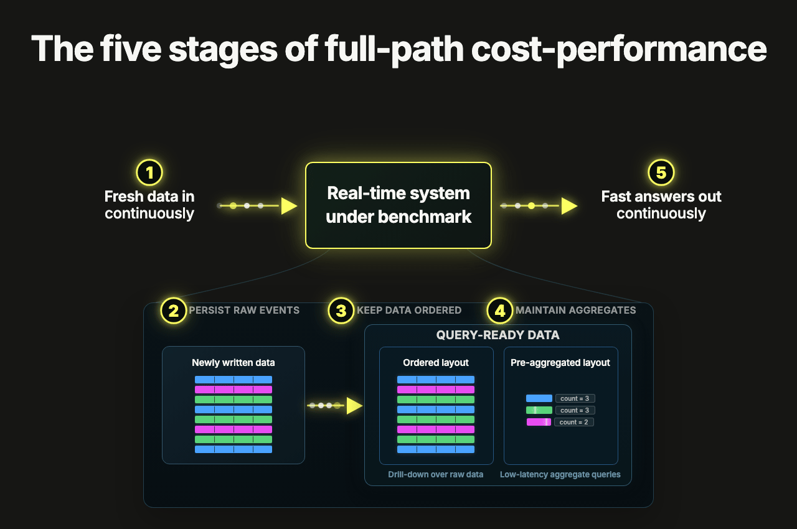

# CostBench

**An open benchmark for real-time analytics cost-performance across the complete analytics path.**

CostBench measures the work and cost required to make continuously arriving data query-ready and
serve analytical queries over it. The current full-path quotes study includes accepted runs for
ClickHouse Cloud, Snowflake, Google BigQuery, and Amazon Redshift Serverless.

> [!NOTE]
> A static query benchmark starts after data has been loaded and prepared. CostBench also measures
> continuous ingest, maintenance of query-ready structures, freshness, and query serving while that
> work remains active.



## Start here

| Area | Purpose |
|---|---|
| [Full-path benchmarks](full-path-realtime/) | Current end-to-end real-time methodology and workloads |
| [Quotes benchmark](full-path-realtime/quotes/) | Accepted multi-provider study, evidence map, and reproduction order |
| [Global visualizations](full-path-realtime/quotes/global/visualizations/) | Provider-neutral chart manifest and reproducible renderers |
| [Legacy query benchmark](query-side-only/) | Read-side comparison over already-prepared data |

## What the full-path benchmark measures

The benchmark keeps the analytics path live from source to answer:

1. Events arrive continuously at a fixed target rate.
2. The provider writes those events into its raw-data path.
3. The raw layout remains usable for drill-down queries.
4. A derived aggregate is maintained for dashboard queries.
5. Dashboard and drill-down workloads run while ingest and maintenance continue.

The published evidence covers:

- ingest progress and successful row counts;
- raw and aggregate query latency during active ingestion;
- persisted materialized-view freshness;
- complete fresh-data-path and matched query cost;
- provider configuration and pricing assumptions;
- source JSONL, reconciled windows, generated CSV, SVG, PNG, and provenance summaries.

This is not a bulk-load benchmark. Systems are evaluated as continuously operating real-time
analytics paths, including provider-specific components such as background refresh compute,
serverless ingestion services, or a required broker layer.

## Current accepted quotes evidence

| System | Accepted evidence | Comparison role |
|---|---|---|
| ClickHouse Cloud | [`results_t2/`](full-path-realtime/quotes/clickhouse-cloud/results_t2/) | Pairwise reference and full-path baseline |
| Snowflake | [`results/t2/`](full-path-realtime/quotes/snowflake/results/t2/) | Accepted Run14 with normalized mixed-rate query attribution |
| BigQuery | [`bq-full-t2-20260810_152224/`](full-path-realtime/quotes/bigquery/results/bq-full-t2-20260810_152224/) | Accepted T2 with Capacity and On-demand alternatives |
| Redshift Serverless | [`results/t2/`](full-path-realtime/quotes/redshift-serverless/results/t2/) | Accepted T2 with SUPER and typed read alternatives |

The global score is:

```text
(complete fresh-data-path cost + matched query cost) × accumulated query runtime
```

Lower is better. Each non-ClickHouse score is normalized within its own accepted pairwise
row-progress window. The global chart combines those accepted pairwise ratios; it does not claim a
single cross-provider iteration join. See the [quotes methodology](full-path-realtime/quotes/) and
the generated provenance JSON beside every chart for the exact contract.

## Reproducibility and review

CostBench publishes the scripts and evidence needed to inspect benchmark claims:

- workload, schema, and query definitions;
- ingest and fixed-rate runner implementations;
- provider configuration and pricing files;
- raw runner results and row-progress reconciliation reports;
- cost calculations and accepted summaries;
- fail-closed visualization manifests and slide-ready outputs.

Generated summaries store repository-relative source paths and SHA-256 hashes. Credential files are
local-only: the repository ignores every `*_credentials.txt` path, and CI rejects credential
artifacts or high-confidence secret material if either is staged accidentally.

## Methodology history

The full-path methodology builds on two earlier CostBench studies:

- [How the 5 major cloud data warehouses compare on cost-performance](https://clickhouse.com/blog/cloud-data-warehouses-cost-performance-comparison) — read-side cost-performance at 1B, 10B, and 100B rows.
- [Agentic analytics starts with query-ready data](https://clickhouse.com/blog/write-side-cost-performance-snowflake-clickhouse) — the write-side cost of keeping raw data query-ready.

Current methodology and background:

- [Introducing CostBench](https://clickhouse.com/blog/costbench-data-warehouse-cost-performance)
- [The end-to-end cost-performance of real-time analytics](https://clickhouse.com/blog/real-time-analytics-cost-performance-snowflake-vs-clickhouse)
- [How the 5 major cloud data warehouses really bill you](https://clickhouse.com/blog/how-cloud-data-warehouses-bill-you)

## Contributing

Cost-performance claims should be reviewable. Pull requests that improve a configuration, pricing
assumption, cost boundary, reconciliation rule, or disclosure are welcome. Keep secrets outside the
repository and run `python3 scripts/check_repository_hygiene.py` before committing.

## License

See [LICENSE](LICENSE).
