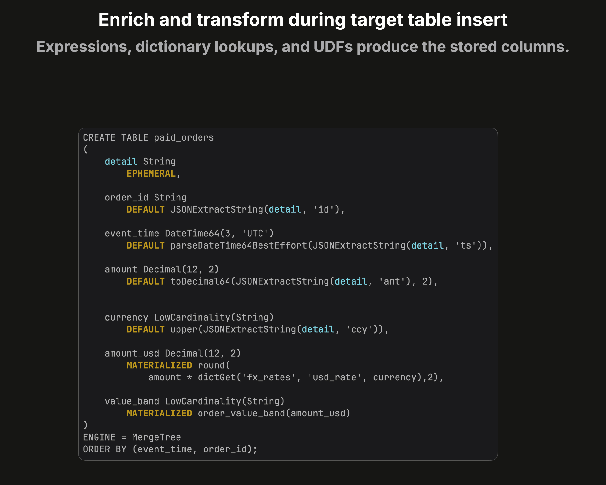

# Native ClickHouse ingestion: routing and transforming rows on insert

ClickHouse can ingest application data directly, without a separate ingestion
service. Every open-source and ClickHouse Cloud node natively supports server-side
buffering, routing, filtering, projection, and extensive write-time
transformations.

The following example uses incremental materialized views as an ingestion
pipeline, not for pre-aggregation.

## 1. Fan out the incoming block

An application inserts mixed event data into `events_in`, a table using the
[Null engine](https://clickhouse.com/docs/reference/engines/table-engines/special/null).

The table stores none of the source rows. Instead, every inserted block triggers
three [materialized views](https://clickhouse.com/docs/materialized-view/incremental-materialized-view), each receiving the same block independently.


This makes the `Null` table a lightweight ingestion entry point that fans one
incoming stream out to multiple processing paths.

## 2. Filter and project in each materialized view

Each materialized view applies its own `SELECT` query to the incoming block.

In this example, the first view:

- retains only `order_paid` events;
- discards all non-matching rows;
- projects only the `detail` column;
- inserts the resulting block into `paid_orders`.


The other views independently route sign-ups and application errors to their
respective target tables.

> [!TIP]
> **Transform once, then fan out again**
>
> A materialized view's `SELECT` query can do far more than filter and project.
> It can reshape rows, cast types, evaluate expressions, perform dictionary
> lookups, and call UDFs before emitting the transformed block.
>
> When several downstream routes need the same transformation, the view can
> target another `Null`-engine table. That table stores nothing; it hands the
> already-transformed block to another layer of materialized views for further
> filtering and routing. This creates a composable, multi-stage ingestion graph
> without repeating the shared transformation in every downstream view.

## 3. Enrich and transform during the target-table insert

The target table can continue transforming the materialized view's output before
anything is stored.



The `paid_orders` schema demonstrates several native transformation mechanisms:

- [EPHEMERAL](https://clickhouse.com/docs/sql-reference/statements/create/table#ephemeral) accepts the raw `detail` JSON for use by other expressions without
  storing it.
- [DEFAULT](https://clickhouse.com/docs/sql-reference/statements/create/table#default) expressions extract fields, cast types, parse timestamps, and
  normalize values.
- [MATERIALIZED](https://clickhouse.com/docs/sql-reference/statements/create/table#materialized) expressions always derive and store additional values.
- A [dictionary](https://clickhouse.com/docs/concepts/features/dictionaries) lookup converts the order amount into USD.
- A [UDF](https://clickhouse.com/docs/reference/functions/regular-functions/udf) classifies the converted amount into a value band.

The raw JSON:

```json
{"id":"o7","ts":"2026-07-22T11:02Z","amt":"149.95","ccy":"eur"}
```

becomes the stored row:

| order_id | event_time          | amount | currency | amount_usd | value_band |
|----------|---------------------|-------:|----------|-----------:|------------|
| o7       | 2026-07-22 11:02:00 | 149.95 | EUR      |     163.45 | medium     |

The input-only `detail` column is absent from the stored row.

## The complete path

**Fan out -> filter and project -> enrich and store**

All three stages run natively in the ClickHouse ingestion path.

## Scale the entire pipeline horizontally

This composable, multi-stage pipeline runs on every ClickHouse node rather than
in a separate, centralized ingestion tier.

In ClickHouse Cloud, the load balancer distributes incoming inserts across the
active nodes. Each node executes its own copy of the complete chain
concurrently—from buffering and fan-out through transformation and final
storage. As the service scales horizontally, the ingestion workload and all of
its processing stages scale with it.

## More information: videos

- [▶ The Null Table Engine](https://clickhouse.com/videos/null-table-engine) -
  use a table that stores nothing to trigger and fan out to materialized views.
- [▶ The EPHEMERAL column modifier](https://clickhouse.com/videos/ephemeral-column-modifier) -
  accept input-only values that can feed expressions without being stored.
- [▶ Deriving columns from other columns](https://clickhouse.com/videos/derive-columns-other-columns) -
  derive values with `DEFAULT`, `MATERIALIZED`, and `ALIAS` expressions.
