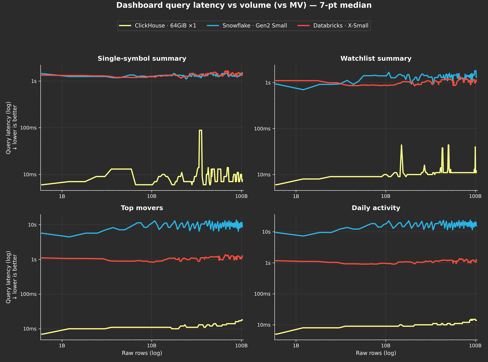
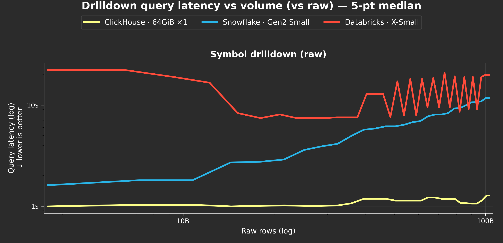
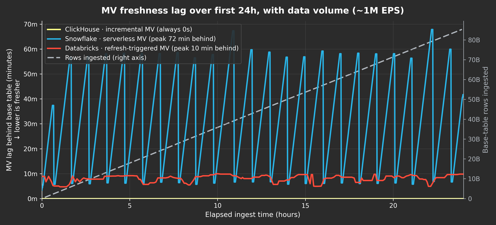
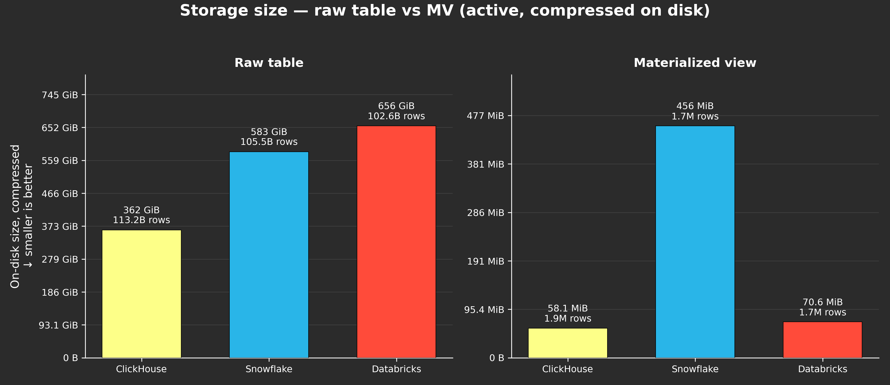

# Ingest Benchmark: ClickHouse Cloud vs Databricks vs Snowflake

Benchmark comparing ingest performance across three systems using a full ingest path: a raw data table plus one Materialized View (MV).

## Dataset

NBBO-style stock market **quotes** (bid/ask snapshots) — a narrow schema with a small row
size and minimal columns. Stored as daily Parquet files (one per trading day), ZSTD-compressed.

### Schema (vendor-agnostic)

| Column | Type | Description |
|---|---|---|
| `sym` | string | Ticker symbol (~3–4 chars) |
| `bx` | uint8 | Bid exchange code |
| `bp` | float64 | Bid price |
| `bs` | uint64 | Bid size |
| `ax` | uint8 | Ask exchange code |
| `ap` | float64 | Ask price |
| `as` | uint64 | Ask size |
| `c` | uint8 | Quote condition code |
| `i` | array&lt;uint8&gt; | Indicator flags (usually empty) |
| `t` | uint64 | Timestamp — Unix epoch, milliseconds (monotonic) |
| `q` | uint64 | Sequence number |
| `z` | uint8 | Tape / exchange group |

Mapped per engine in each system's `create.sql` (e.g. `string`→`String`/`VARCHAR`/`STRING`,
`uint8`→`UInt8`/`NUMBER(3,0)`/`SMALLINT`, `array<uint8>`→`Array(UInt8)`/`ARRAY`). `as` is a
reserved word and is quoted everywhere.

### Size

| Metric | Value |
|---|---|
| Total rows | ~113 billion |
| Total size | ~651 GB (Parquet, ZSTD) |
| Files | 232 daily files (`quotes_YYYY-MM-DD.parquet`); empty on market-closed days |
| Avg file size | ~2.8 GB across all files; a typical trading day is ~4.6 GB / ~808M rows |
| Row group | ~130K rows |
| Row size | ~5.7 bytes/row compressed (~63 bytes uncompressed) |

To sustain ingest past the dataset's end, files are replayed; each run reaches ~100B+ rows.

### Data source & licensing

The quotes data comes from **[Massive](https://massive.com/)**, a US market-data API provider
(REST + WebSocket + bulk "flat files"). We access it under a partnership that **does not permit
redistribution**, so this repo ships only the ingest/query scripts and the aggregated results —
**not** the dataset itself. To reproduce the benchmark you bring your own Massive data.

**Getting the data (no partnership required):**

The dataset is a **capture of Massive's real-time quotes WebSocket**, recorded to daily Parquet
files — not a historical pull. To reproduce it:

1. Get a Massive plan with **real-time stock quotes** access (per the docs, Stocks Advanced for
   personal use, or Business + Expansion) and an API key.
2. Connect to the quotes stream
   ([`WS /stocks/Q`](https://massive.com/docs/websocket/stocks/quotes)) and subscribe to **all
   tickers** (`ticker=*`). Each message is one NBBO quote whose fields map 1:1 to the schema
   above (`sym, bx, bp, bs, ax, ap, as, c, i, t, q, z`).
3. Record the stream and batch messages into one Parquet file per trading day
   (`quotes_YYYY-MM-DD.parquet`), then point each system's `download_*` script at your copy (the
   rest of the pipeline is unchanged). Because WebSocket is a live feed, you capture **going
   forward** over a comparable multi-day window — you can't pull a past window from the socket.

For a fixed *historical* window instead (same data, different path/format), use the REST
[`Quotes`](https://massive.com/docs/rest/stocks/trades-quotes/quotes) endpoint (paged per ticker)
or [Flat Files](https://massive.com/docs/flat-files/stocks/quotes) (bulk daily CSV).

**License you'll need to reproduce it:**

- **Personal / non-commercial:** an individual plan with **real-time access** (Stocks Advanced)
  lets a non-professional user stream the full US quotes feed for personal use — enough to
  re-run this benchmark yourself. See [pricing](https://massive.com/pricing) and the
  [Individuals Terms of Service](https://massive.com/legal/individuals-terms-of-service).
- **Commercial / business:** requires a [business plan](https://massive.com/business); under US
  market-data rules, real-time exchange data also carries **exchange licensing agreements and
  fees** on top of the subscription. See the
  [Market Data Terms of Service](https://massive.com/legal/market-data-terms-of-service).
- **Redistribution** (republishing the raw data or sharing the dataset) is **not allowed on
  standard plans** — it needs a separate redistribution agreement with Massive
  ([details](https://massive.com/knowledge-base/article/how-can-i-redistribute-massives-market-data)).
  That restriction is why the dataset is not included here.

Plan names, limits, and fees change — confirm the current terms on Massive's pricing and legal
pages before relying on them.

## Ingest setup

All three systems ingested at the same throughput rate with the same batch size, reading from the same Parquet files using equivalent ingest script logic.

| Parameter | Value |
|---|---|
| Target throughput | 1M events/sec |
| Batch size | ~1M rows |
| Source | Parquet files |
| Ingest path | Raw table + 1 MV |

Smallest hardware configuration that could sustain 1M eps was selected for each platform.

| System | Write hardware |
|---|---|
| ClickHouse Cloud | 2 nodes × 2 vCPUs / 8 GiB RAM |
| Databricks | 2X-Small Warehouse — 8 vCPUs / 61 GiB RAM |
| Snowflake | Gen2 X-Small Warehouse — 8 vCPUs / 16 GB RAM |

## Read setup

Read and write compute are separated (compute-compute separation) so query workloads run on isolated hardware. Read hardware was aligned on CPU core count across platforms.

| System | Read hardware |
|---|---|
| ClickHouse Cloud | 1 node × 16 vCPUs / 64 GiB RAM |
| Databricks | X-Small Warehouse — 16 vCPUs / 122 GiB RAM |
| Snowflake | Gen2 Small Warehouse — 16 vCPUs / 32 GB RAM |

Read query pattern:

- Every 10 minutes: 4 queries against the MV simulating a live dashboard
- Every hour: 1 drill-down query against the raw data table

## Results

Query latency is the server-side execution time, sampled as the table grows to ~100B rows.
Lines are a rolling median over the per-iteration samples; axes are log scale.
Chart renderers and inputs are in [`_viz/`](_viz) (`_viz/_calls.txt` reproduces every chart).

### Dashboard latency (4 queries vs the MV)

### Drill-down latency (1 query vs the raw table)

### MV freshness lag

How far behind each system's MV falls under sustained 1M eps, over the first 24h, with rows
ingested on the right axis. ClickHouse's MV is synchronous (always in sync, flat 0s);
Databricks' refresh-triggered MV stays within its refresh interval (~8–10 min); Snowflake's
serverless MV sawtooths up to ~72 min behind.

### Storage size

Current active compressed on-disk size of the raw table and the MV, per system, each bar
labelled with its total row count. Excludes Snowflake time-travel + fail-safe and Databricks
time-travel — the active footprint only.

ClickHouse's raw table is the smallest (362 GiB) even though it holds the most rows (113.2B),
vs Snowflake 583 GiB (105.5B rows) and Databricks 656 GiB (102.6B rows). ClickHouse and
Databricks MVs are comparable (58 / 71 MiB); Snowflake's MV is ~8× larger (456 MiB) because it
stores un-compacted physical aggregate fragments (14.88M physical rows over 1.72M logical
`(sym, day)` groups).

#### Why the storage differs (hypotheses)

These are informed guesses from how each engine stores data, not per-column measurements.

**Raw table** (~3.4 vs 5.9 vs 6.9 bytes/row; identical data, and ClickHouse has the *most*
rows yet is smallest — so it's purely storage efficiency):

- **Strength of physical ordering** (likely the biggest factor). All three "cluster by
  (sym, t)", but ClickHouse's `ORDER BY (sym, t)` is a *hard total sort*, so `sym` becomes long
  identical runs and `t` is monotonic within each sym → adjacent values are near-identical and
  the compressor gets very long matches. Snowflake and Databricks clustering is *approximate,
  background* ordering, so those same columns compress less well.
- **Type representation & codecs.** ClickHouse stores native fixed-width `UInt*/Float64` and is
  built to crush sorted integer/timestamp columns (and could go further with explicit
  `Delta`/`DoubleDelta`/`Gorilla` codecs). Snowflake maps ints to `NUMBER(20,0)` with
  general-purpose auto-encoding; Databricks uses Spark's default Parquet encodings, the least
  aggressive of the three.
- **Hidden metadata (Databricks).** `delta.enableRowTracking=true` materializes per-row
  `_row_id` / `_commit_version` columns into the data files — extra bytes on 100B rows — plus
  Parquet page/footer overhead; a likely reason it's the largest.
- **Incompressible floor.** `bp`/`ap` are `Float64` prices (high-entropy) that compress poorly
  everywhere; they set a common floor, and the spread above it is all in the
  integer/timestamp/low-cardinality columns where ClickHouse's strict sort + native types win.

**MV** (Snowflake ~8× the others — a fragmentation story, not bigger data): Snowflake's MV holds
14.88M physical rows over 1.72M logical groups because each incremental maintenance pass
*appends* partial-aggregate fragments and compaction is lazy; per *physical* row it's ~32 B —
the same as ClickHouse per logical row — so the data is compact, there are just ~8.6× as many
rows (a forced compaction would shrink it). ClickHouse vs Databricks (58 vs 71 MiB) is a wash:
both store ~one compact row per `(sym, day)` group; Databricks' edge is Parquet/Delta per-file
overhead, which weighs more on a tiny table.

Caveats: all point-in-time (not fully settled); compression settings weren't normalized; and
Snowflake's number excludes time-travel (1.06 TiB) + fail-safe (787 GiB), so total stored bytes
diverge even more than the active-footprint chart.
