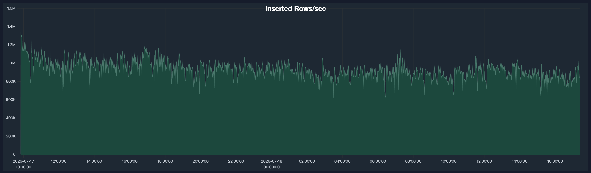
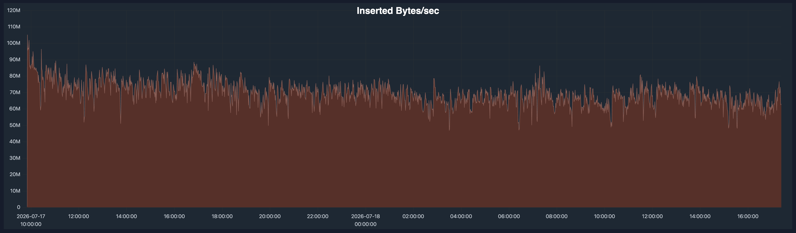
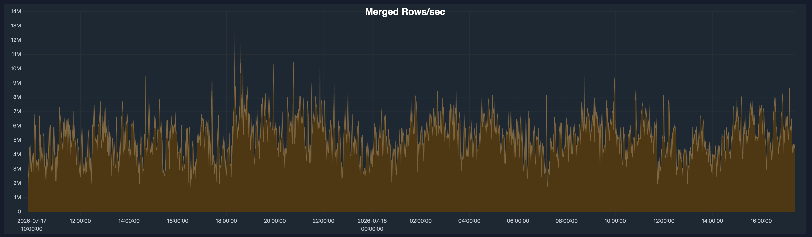
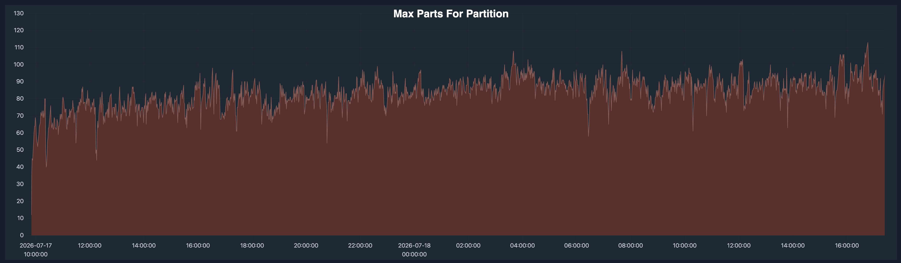
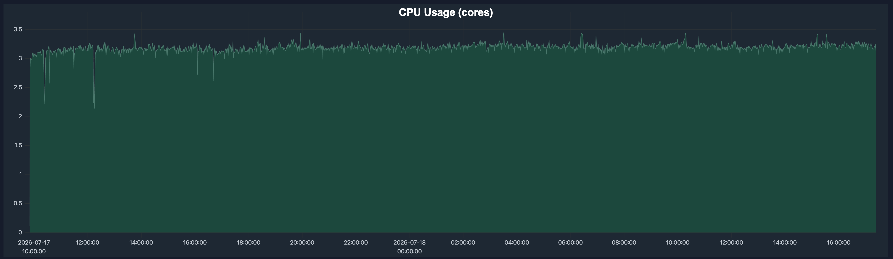
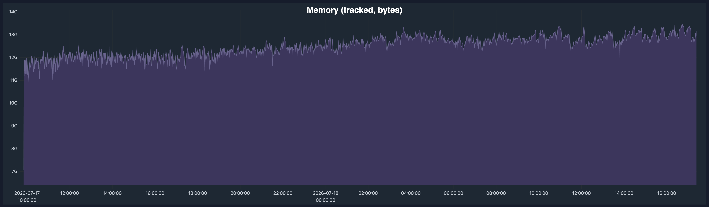

# ClickHouse Cloud writer utilization (async-insert run)

This folder contains utilization screenshots for the ClickHouse Cloud write and ordering service used in the Snowpipe Streaming vs. async inserts benchmark run.

The service was responsible for the write side of the benchmark: receiving the continuous stock-quotes stream via **asynchronous inserts**, writing raw data into a sorted `MergeTree` table, maintaining pre-aggregations through incremental materialized views into an `AggregatingMergeTree` table, and keeping both tables query-ready while the read workload ran on a separate service.

The charts below come from the ClickHouse Cloud advanced dashboard and show the writer service during the benchmark run.

## Setup

The write service used:

- **2 ClickHouse Cloud nodes**
- **2 CPU cores per node**
- **8 GiB RAM per node**
- continuous ingest at roughly **1 million rows/sec**, pushed by 8 concurrent client workers in 3,000-row batches
- **asynchronous inserts** (`async_insert = 1`) with default settings
- raw data written to a sorted `MergeTree` table
- pre-aggregated data maintained through incremental materialized views into an `AggregatingMergeTree` table

## Async insert settings: defaults only

We enabled async inserts and changed nothing else. With the default settings, each node buffers incoming inserts server-side and flushes the buffer to disk as a single part when the **first** of these thresholds is reached:

- **Buffer size**: 100 MiB of buffered data (`async_insert_max_data_size`)
- **Flush timeout**: an adaptive timeout between 50 ms and 1 second on ClickHouse Cloud (`async_insert_busy_timeout_min_ms` / `async_insert_busy_timeout_max_ms`) — the timeout self-adjusts to the incoming data rate
- **Query count**: 450 buffered insert queries (`async_insert_max_query_number`)

We also kept the default return mode (`wait_for_async_insert = 1`): the server acknowledges each insert only after its buffer has been flushed to disk, so the client gets full durability guarantees.

In other words: no tuning was required to sustain 1 million rows per second of small-batch inserts from concurrent clients.

## 1. Inserted rows/sec

This chart validates that the writer service sustained the target ingest rate throughout the run.

Rows/sec stayed close to **1 million rows per second**. The important point is that the service continuously kept up with the configured real-time ingest rate instead of falling behind — now with the server, not the client, doing the batching.

## 2. Inserted bytes/sec

Rows/sec alone can be misleading: many tiny rows are not the same as wider analytical rows. This chart shows the actual byte throughput handled by the writer service.

The workload sustained roughly **60–80 MB/sec** of inserted data.

## 3. Merged rows/sec

ClickHouse keeps tables query-ready through continuous background merges. These merges preserve the physical layout required for efficient reads.

The merged rows/sec chart shows that background merges were active throughout the run, typically processing several million rows per second. Because async inserts flush optimally sized parts instead of one part per small client batch, initial part creation — and with it merge pressure — stays low.

## 4. Max parts per partition

Part count is an important signal for whether background merges are keeping up. If inserts create parts faster than merges can reduce their number, the number of active parts grows without bound and eventually hurts query performance.

In this run, the maximum part count remained under control throughout, staying at roughly **100 parts or fewer**. Server-side buffering plus continuous merges kept the part count bounded, even with 8 concurrent clients sending small 3,000-row batches at an aggregate 1 million rows per second.

## 5. CPU usage

This chart shows CPU usage on the writer service during the run.

CPU was well utilized but did not saturate. The service had enough work to do — buffering and flushing async inserts, sorting, materialized-view updates, and merges — but still had headroom instead of running pinned at the limit.

## 6. Memory usage

This chart shows tracked memory usage on the writer service.

Memory stayed stable during the run, with normal variation but no sustained upward trend. That indicates the workload was bounded: async insert buffers were flushed continuously, and the service was not accumulating unmerged data or refresh state in memory.

## Summary

Together, these charts validate the ClickHouse write-side setup used in the benchmark.

With asynchronous inserts enabled — at pure default settings — the writer service sustained the target ingest rate from many small concurrent batches, handled the corresponding byte throughput, kept background merges active, maintained part counts under control, and used CPU and memory without saturating. ClickHouse kept the raw `MergeTree` table and the pre-aggregated `AggregatingMergeTree` table fresh and query-ready continuously while new stock-quotes data kept arriving.
